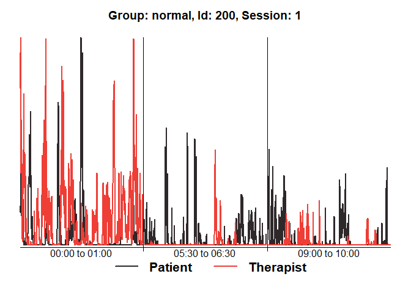
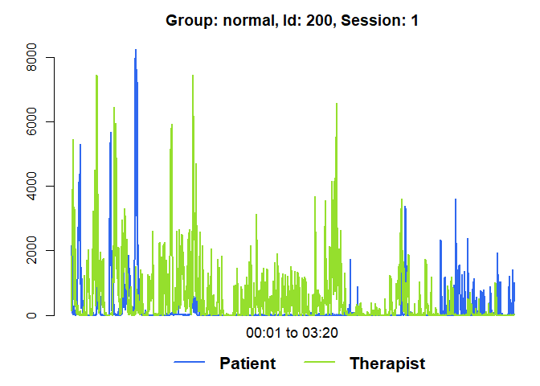
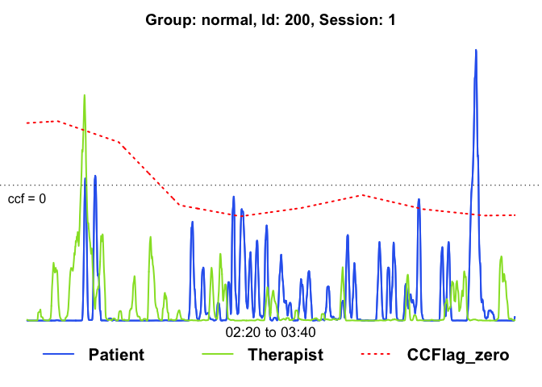
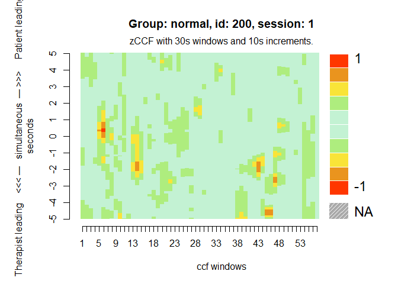
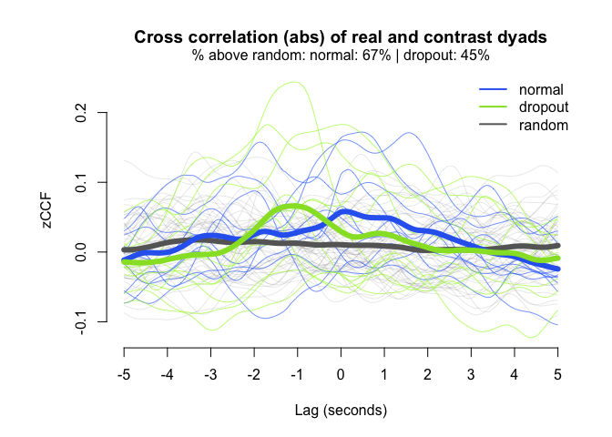

<!-- README.md is generated from README.Rmd. Please edit that file -->
rMEA
====

The goal of rMEA is to provide a suite of tools useful to read, visualize and export bivariate Motion Energy time-series. Lagged synchrony between subjects can be analyzed through windowed cross-correlation. Surrogate data generation allows an estimation of pseudosynchrony that helps to estimate the effect size of the observed synchronization.

Example
-------

This example shows a complete analysis pipeline consisting on Motion Energy time-series import, pre-processing, cross-correlation analysis and comparison between groups against pseudosynchrony.

``` r
library(rMEA)

## read the first sample (intake interviews of patients that carried on therapy)
path_normal <- system.file("extdata/normal", package = "rMEA")
mea_normal <- readMEA(path_normal, sampRate = 25, s1Col = 1, s2Col = 2,
                     s1Name = "Patient", s2Name = "Therapist", skip=1,
                     idOrder = c("id","session"), idSep="_")
#> 
#> STEP 1 | Reading 10 dyads
#> ..................................................|100%
#> ..................................................|Done ;)
#> Warning: 0.07% of the data was higher than 10 standard deviations in dyad:
#> 200, session: 1, group:all. Check the raw data!
#> Warning: 0.03% of the data was higher than 10 standard deviations in dyad:
#> 201, session: 1, group:all. Check the raw data!
#> Warning: 0.03% of the data was higher than 10 standard deviations in dyad:
#> 202, session: 1, group:all. Check the raw data!
#> Warning: 0.04% of the data was higher than 10 standard deviations in dyad:
#> 204, session: 1, group:all. Check the raw data!
#> Warning: 0.01% of the data was higher than 10 standard deviations in dyad:
#> 205, session: 1, group:all. Check the raw data!
#> Warning: 0.05% of the data was higher than 10 standard deviations in dyad:
#> 206, session: 1, group:all. Check the raw data!
#> Warning: 0.01% of the data was higher than 10 standard deviations in dyad:
#> 208, session: 1, group:all. Check the raw data!
#> 
#> STEP 2 | ReadMEA report
#>      Filename id_dyad session group duration_hh.mm.ss Patient_%
#> 1  200_01.txt     200       1   all          00:10:00      50.1
#> 2  201_01.txt     201       1   all          00:10:00      50.2
#> 3  202_01.txt     202       1   all          00:10:00      44.6
#> 4  203_01.txt     203       1   all          00:10:00      97.4
#> 5  204_01.txt     204       1   all          00:10:00      66.4
#> 6  205_01.txt     205       1   all          00:10:00      84.3
#> 7  206_01.txt     206       1   all          00:10:00      30.3
#> 8  207_01.txt     207       1   all          00:10:00      52.5
#> 9  208_01.txt     208       1   all          00:10:00      76.6
#> 10 209_01.txt     209       1   all          00:10:00      72.4
#>    Therapist_%
#> 1         59.5
#> 2         74.7
#> 3         47.1
#> 4         73.1
#> 5         55.7
#> 6         69.9
#> 7         34.4
#> 8         42.3
#> 9         44.2
#> 10        63.1
mea_normal <- setGroup(mea_normal, "normal")

## read the second sample (intake interviews of patients that dropped out)
path_dropout <- system.file("extdata/dropout", package = "rMEA")
mea_dropout <- readMEA(path_dropout, sampRate = 25, s1Col = 1, s2Col = 2,
                     s1Name = "Patient", s2Name = "Therapist", skip=1,
                     idOrder = c("id","session"), idSep="_")
#> 
#> STEP 1 | Reading 10 dyads
#> ..................................................|100%
#> ..................................................|Done ;)
#> Warning: 0.03% of the data was higher than 10 standard deviations in dyad:
#> 100, session: 1, group:all. Check the raw data!
#> Warning: 0.01% of the data was higher than 10 standard deviations in dyad:
#> 101, session: 1, group:all. Check the raw data!
#> Warning: 0.09% of the data was higher than 10 standard deviations in dyad:
#> 104, session: 1, group:all. Check the raw data!
#> Warning: 0.02% of the data was higher than 10 standard deviations in dyad:
#> 105, session: 1, group:all. Check the raw data!
#> Warning: 0.1% of the data was higher than 10 standard deviations in dyad:
#> 106, session: 1, group:all. Check the raw data!
#> 
#> STEP 2 | ReadMEA report
#>      Filename id_dyad session group duration_hh.mm.ss Patient_%
#> 1  100_01.txt     100       1   all          00:10:00      85.0
#> 2  101_01.txt     101       1   all          00:10:00      84.2
#> 3  102_01.txt     102       1   all          00:10:00      90.9
#> 4  103_01.txt     103       1   all          00:10:00      72.5
#> 5  104_01.txt     104       1   all          00:10:00      72.5
#> 6  105_01.txt     105       1   all          00:10:00      69.2
#> 7  106_01.txt     106       1   all          00:10:00      76.7
#> 8  107_01.txt     107       1   all          00:10:00      95.4
#> 9  108_01.txt     108       1   all          00:10:00      80.1
#> 10 109_01.txt     109       1   all          00:10:00      85.0
#>    Therapist_%
#> 1         97.2
#> 2         88.0
#> 3         95.1
#> 4         90.7
#> 5         73.9
#> 6         83.5
#> 7         66.1
#> 8         79.5
#> 9         96.5
#> 10        87.3
mea_dropout <- setGroup(mea_dropout, "dropout")

## Combine into a single object
mea_all <- c(mea_normal, mea_dropout)

summary(mea_all)
#> 
#> MEA analysis results:
#>               dyad session   group Patient_% Therapist_%
#> normal_200_1   200       1  normal      50.1        59.5
#> normal_201_1   201       1  normal      50.2        74.7
#> normal_202_1   202       1  normal      44.6        47.1
#> normal_203_1   203       1  normal      97.4        73.1
#> normal_204_1   204       1  normal      66.4        55.7
#> normal_205_1   205       1  normal      84.3        69.9
#> normal_206_1   206       1  normal      30.3        34.4
#> normal_207_1   207       1  normal      52.5        42.3
#> normal_208_1   208       1  normal      76.6        44.2
#> normal_209_1   209       1  normal      72.4        63.1
#> dropout_100_1  100       1 dropout      85.0        97.2
#> dropout_101_1  101       1 dropout      84.2        88.0
#> dropout_102_1  102       1 dropout      90.9        95.1
#> dropout_103_1  103       1 dropout      72.5        90.7
#> dropout_104_1  104       1 dropout      72.5        73.9
#> dropout_105_1  105       1 dropout      69.2        83.5
#> dropout_106_1  106       1 dropout      76.7        66.1
#> dropout_107_1  107       1 dropout      95.4        79.5
#> dropout_108_1  108       1 dropout      80.1        96.5
#> dropout_109_1  109       1 dropout      85.0        87.3
#> 
#> Data processing:  raw

## Show diagnostics for the first session:
diagnosticPlot(mea_all[[1]])
```



``` r
plot(mea_all[[1]], from=3500, to=5500)
```



``` r

## Filter the data
mea_smoothed <- MEAsmooth(mea_all)
#> 
#> Moving average smoothing:
#> ..................................................|100%
#> ..................................................|Done ;)
mea_rescaled <- MEAscale(mea_smoothed)
#> 
#> Rescaling data:
#> ..................................................|100%
#> ..................................................|Done ;)

## Generate a random sample
mea_random <- shuffle(mea_rescaled, 50)
#> 
#> Shuffling dyads:
#> ..................................................|100%
#> ..................................................|Done ;)
#> 
#>  50 / 760 possible combinations were randomly selected

## Run CCF analysis
mea_ccf <- MEAccf(mea_rescaled, lagSec= 5, winSec = 30, incSec=10, ABS = F)
#> 
#> Computing CCF:
#> ..................................................|100%
#> ..................................................|Done ;)
mea_random_ccf <- MEAccf(mea_random, lagSec= 5, winSec = 30, incSec=10, ABS = F)
#> 
#> Computing CCF:
#> ..................................................|100%
#> ..................................................|Done ;)

## Visualize results

# Raw data of the first session with running lag-0 ccf
plot(mea_ccf[[1]], from=3500, to=5500, ccf = "zero")
```



``` r

# Heatmap of the first session
MEAheatmap(mea_ccf[[1]])
```



``` r

# Distribution of the ccf calculations by group, against random matched dyads
MEAdistplot(mea_ccf, contrast = mea_random_ccf)
```


``` r

# Representation of the average cross-correlations by lag
MEAlagplot(mea_ccf, contrast=mea_random_ccf)
```


